## Quiz Pekan 3 Damar - RESTful API Golang

### Fitur pada project ini,

1. Proses Autentikasi - Register dan Login dengan JWT.

2. CRUD kategori buku yang dibungkus dengan router dan middleware.

3. CRUD data buku yang berelasi terhadap data kategori dan validasi tahun (1980-2024).

---


### Daftar Path (Endpoint)

---

| Method | Path | Deskripsi End point |
| :--- | :--- | :--- |
| `POST` | `/api/users/register` | Registrasi User |
| `POST` | `/api/users/login` | Login User |
| `GET` | `/api/categories` | Menampilkan semua kategori |
| `GET` | `/api/categories/:id` | Detail kategori berdasarkan ID |
| `POST` | `/api/categories` | Menambah kategori baru |
| `PUT` | `/api/categories/:id` | Mengupdate kategori |
| `DELETE` | `/api/categories/:id` | Menghapus kategori |
| `GET` | `/api/categories/:id/books` | Menampilkan buku dalam kategori tertentu |
| `GET` | `/api/books` | Menampilkan semua buku |
| `GET` | `/api/books/:id` | Detail buku berdasarkan ID |
| `POST` | `/api/books` | Menambah buku baru |
| `PUT` | `/api/books/:id` | Mengupdate buku |
| `DELETE` | `/api/books/:id` | Menghapus buku |

---

### Cara Penggunaan

---

Sebelum melakukan request ke fitur CRUD baik buku maupun kategori wajib melakukan registrasi dan kemudian login.
Hasil dari login nantinya mendapat token yang dapat digunakan untuk mengakses CRUD buku ataupun kategori.

Langkah memulai-nya:

### 1. Masuk ke postman kemudian paste link berikut pada kolom URL di postman: <br/>
    ```
    https://quiz-pekan3-damar-production.up.railway.app/api/users/register
    ```
### 2. Lalu lakukan registrasi bisa lihat pada gambar dibawah ini.<br/>
- Set METHOD : POST. <br/>
- **Cari tab Body** kemudian pilih **RAW** dan **pastikan JSON** lalu isi Isi username dan paswordnya. (disini output balikan dari json saya blur passwordnya dengan diganti jadi ****)<br/>
<h3>Proses Registrasi</h3>
<p align="left">
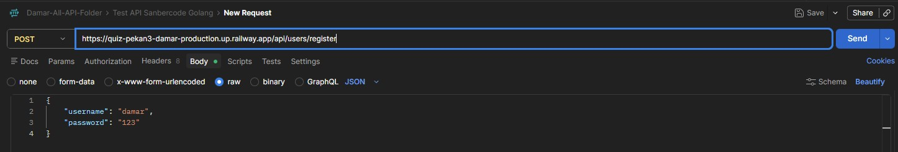
</p>
<h3>Lokasi Tag Body</h3>
<p align="left">
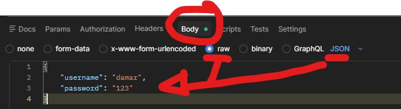
</p> <br/>

### 3. Setelah memasukan username dan password klik send, setelah berhasil ganti end-pointnya jadi **/api/users/login**, bisa dilihat pada gambar dibawah ini.<br/><br/>
    
- Set METHOD : POST. <br/>
- Isi username dan paswordnya. <br/>

<h3>Proses Login</h3>
<p align="left">
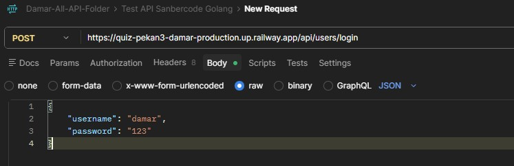
</p><br/>

### 4. Saat Login sudah sukses, maka pada result body dibawah sendiri akan muncul **token**, dan **token** ini nanti yang akan dipasang dan digunakan untuk akses crud buku dan kategori, hasil saat login sukses dapat dilihat pada gambar dibawah ini.<br/>
<h3>Login Sukses / Berhasil</h3>
<p align="left">
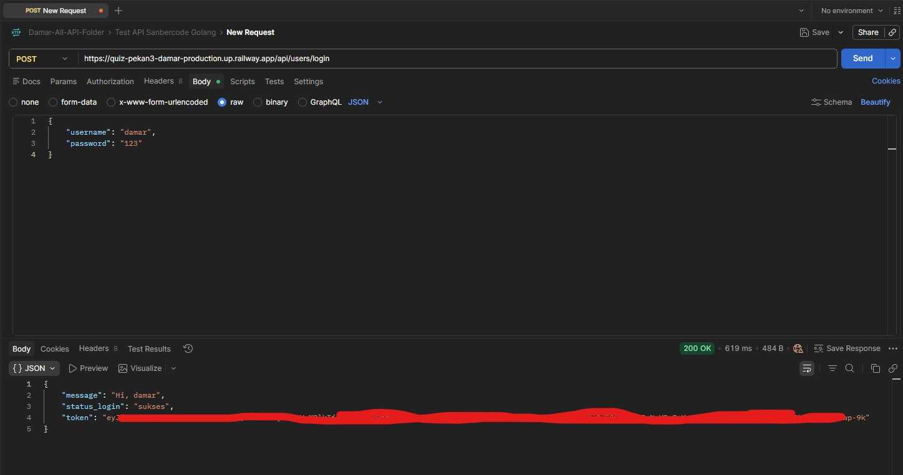
</p><br/>

### 5. Setelah Login berhasil, selanjutnya Memasang Bearer JWT Token ke **Tab Authorization** pada postman.<br/>
- Pastikan membuka tab workspace baru disamping kanan tab workspace yang kita gunakan saat register dan login tadi (Jangan ditutup tab-nya).<br/>
<h3>Lokasi Tab Workspace Baru</h3>
<p align="left">
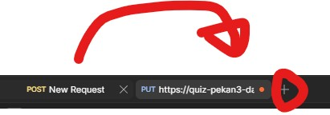
</p>
<h3>Lokasi Tab Authorization</h3>
<p align="left">
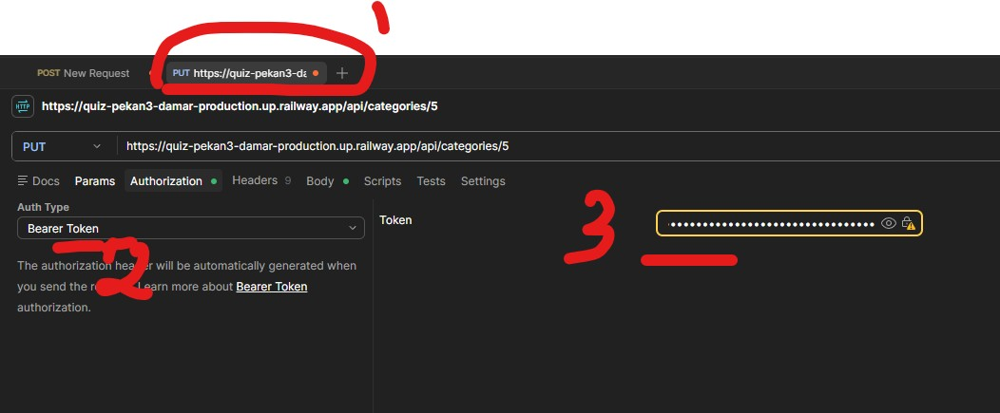
</p>

### 6. Pada Authorization, nanti cukup pilih Auth-type : Bearer Token, dan isi tokennya yang diperoleh dari proses login tadi.<br/>
### 7. Setelah itu dapat dilihat berikut ini proses yang sudah dicoba pada Restful API ini.

---

## Hasil Uji Coba

### 1. /api/categories - Method yang digunakan adalah get. Api ini digunakan untuk menampilkan seluruh kategori
<p align="left">
  <strong>METHOD GET - Menampilkan Semua Kategori</strong><br>
  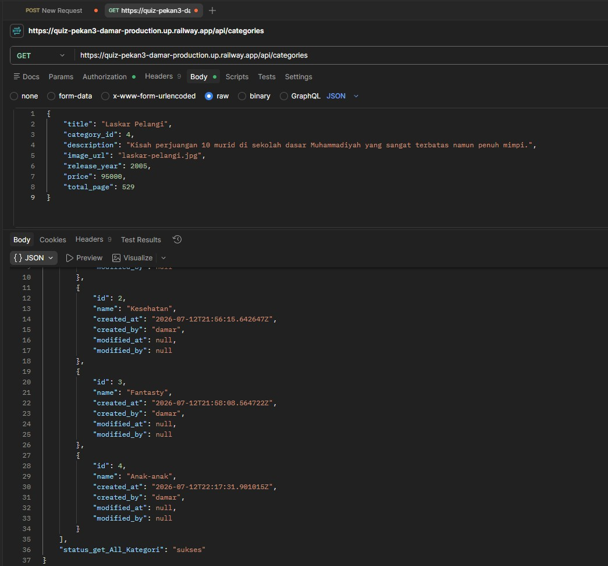
</p>

### 2. /api/categories Method yang digunakan adalah post. Api ini digunakan untuk menambahkan kategori.

<p align="left">
  <strong>METHOD POST - Insert / Tambah Kategori</strong><br>
  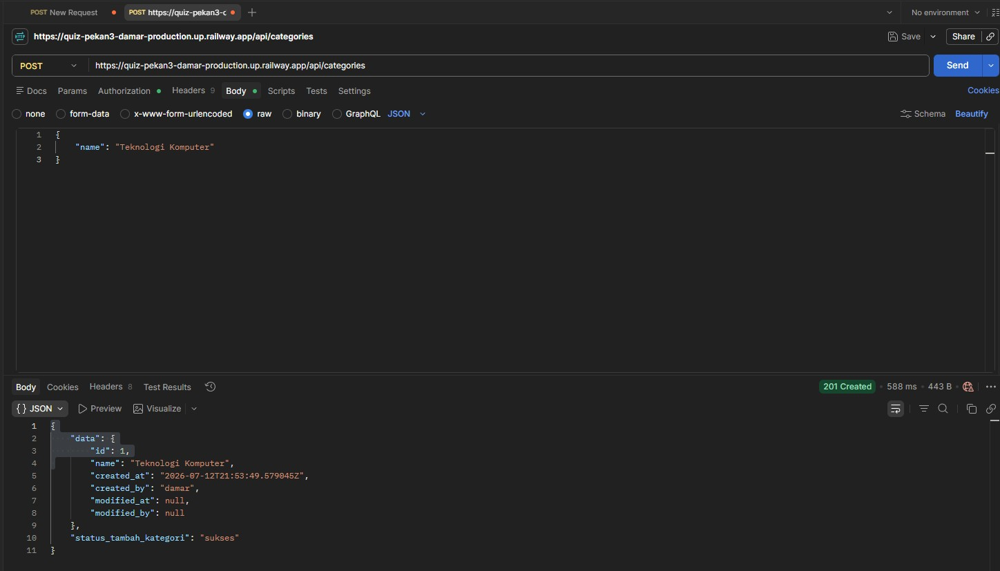
</p>

### 3. /api/categories/:id Method yang digunakan adalah get. Api ini digunakan untuk menampilkan detail kategori.

<p align="left">
  <strong>METHOD GET - Menampilkan Kategori Berdasarkan ID</strong><br>
  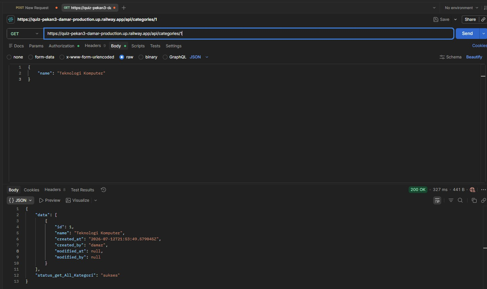
</p>

### 4. localhost:8080/api/categories/:id Method yang digunakan adalah PUT.

<p align="left">
  <strong>METHOD PUT - Update Kategori Berdasarkan ID</strong><br>
  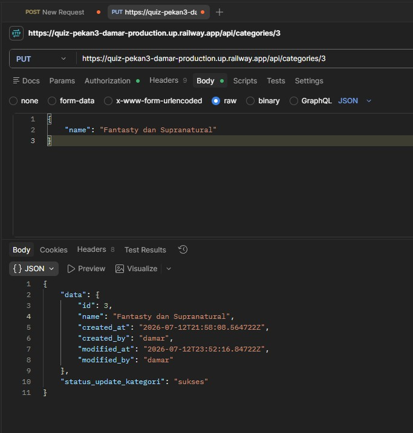
</p>

### 5. /api/categories/:id Method yang digunakan adalah delete. Api ini digunakan untuk menghapus kategori.

<p align="left">
  <strong>METHOD DELETE - Menghapus Kategori Buku</strong><br>
  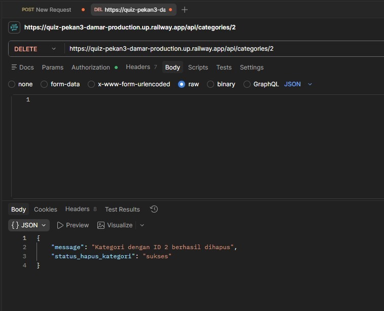
</p>
<p align="left">
  <strong>METHOD DELETE - Menghapus Kategori Buku yang tidak tersedia</strong><br>
  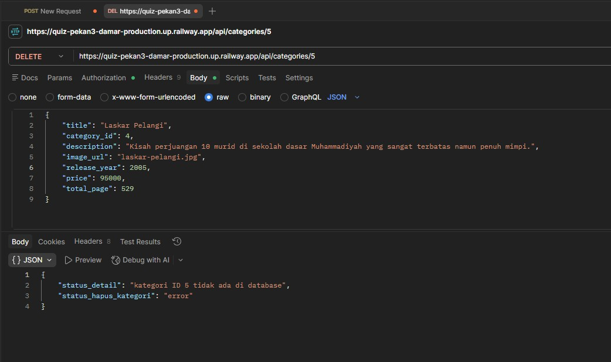
</p>

### 6. /api/categories/:id/books Method yang digunakan adalah get.  Api ini digunakan untuk menampilkan buku yang tersedia berdasarkan ketegori tertentu.

<p align="left">
  <strong>METHOD - GET - Melihat detail buku berdasarkan kategori bukunya.</strong><br>
  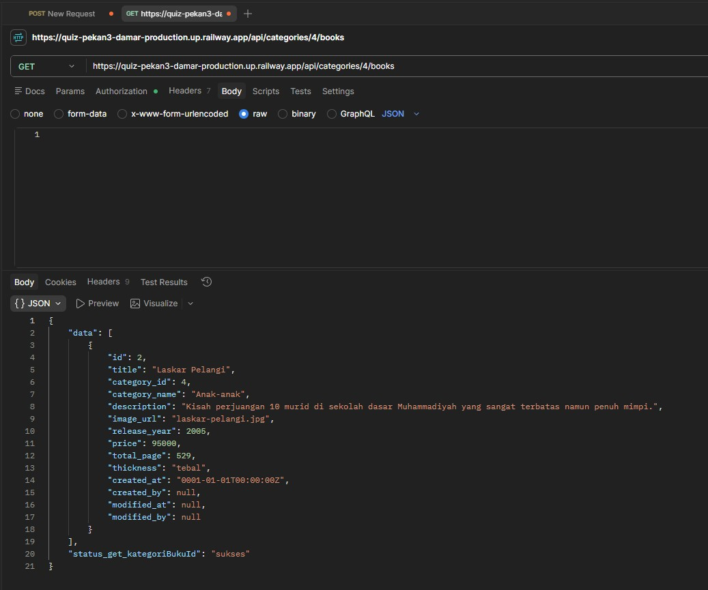
</p>

### 7. /api/books  Method yang digunakan adalah get.  Api ini digunakan untuk menampilkan buku yang tersedia berdasarkan ketegori tertentu.

<p align="left">
  <strong>METHOD - GET - Melihat semua buku.</strong><br>
  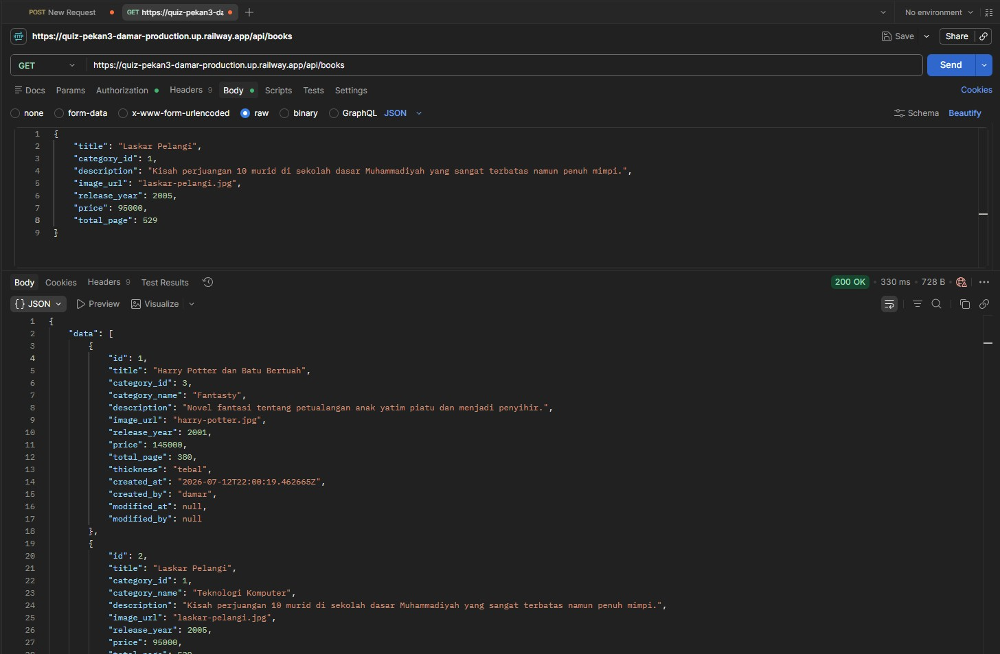
</p>

### 8. /api/books Method yang digunakan adalah post.  Api ini digunakan untuk menambahkan buku.

<p align="left">
  <strong>METHOD - POST - Tambah buku.</strong><br>
  
</p>

### 9. /api/books/:id Method yang digunakan adalah get. Api ini digunakan untuk menampilkan detail buku.

<p align="left">
  <strong>METHOD - GET - Detail buku berdasarkan ID.</strong><br>
  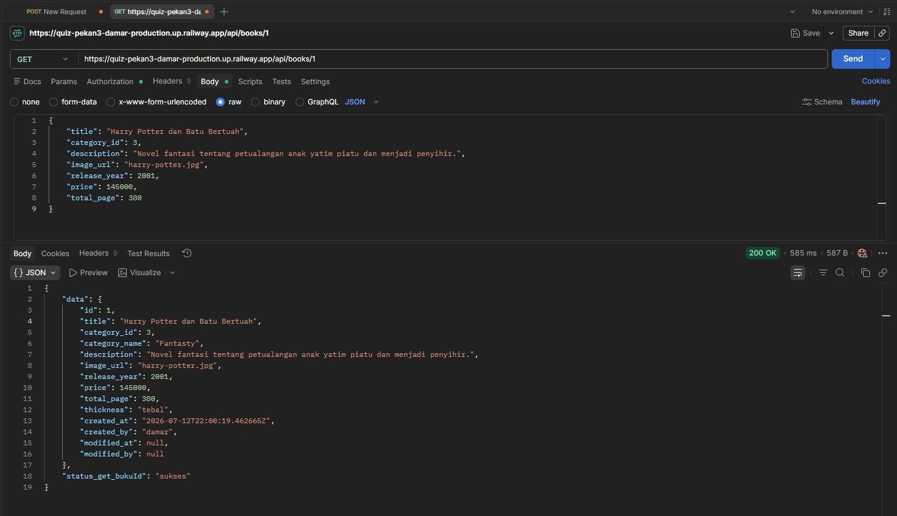
</p>

<p align="left">
  <strong>METHOD - GET - Handle ID Buku jika Tidak ditemukan.</strong><br>
  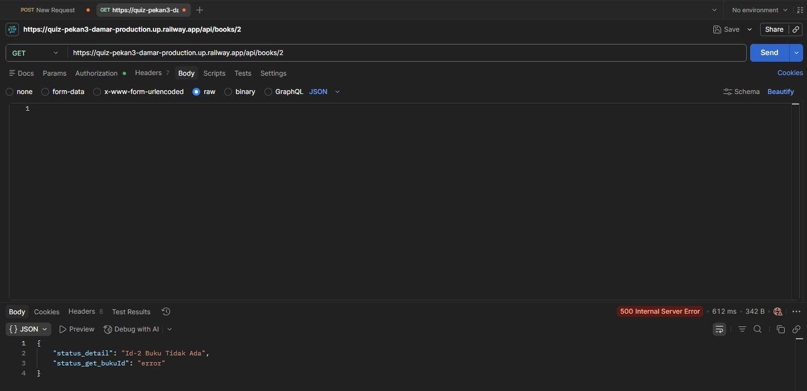
</p>

### 10. Buatlah validasi untuk api buku mengikuti ketentuan berikut. -> validasi untuk memastikan bahwa release_year hanya berisi inputan minimal 1980 dan maksimal 2024.

<p align="left">
  <strong>METHOD - POST - Tambah Buku namun tahun rilisnya tahun 1901.</strong><br>
  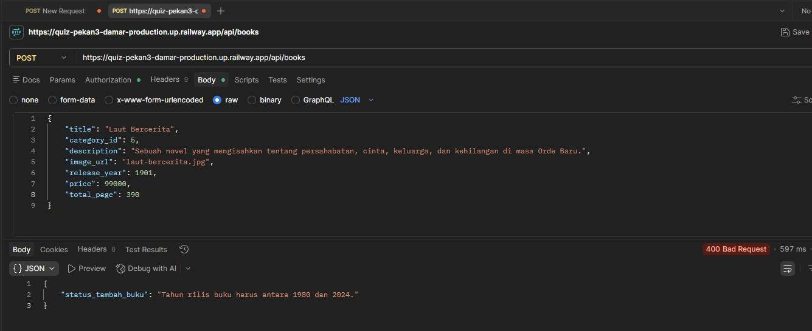
</p>

---

<footer>
  <p align="center">
    @Damar Djati Wahyu Kemala 2026
  </p>
</footer>


